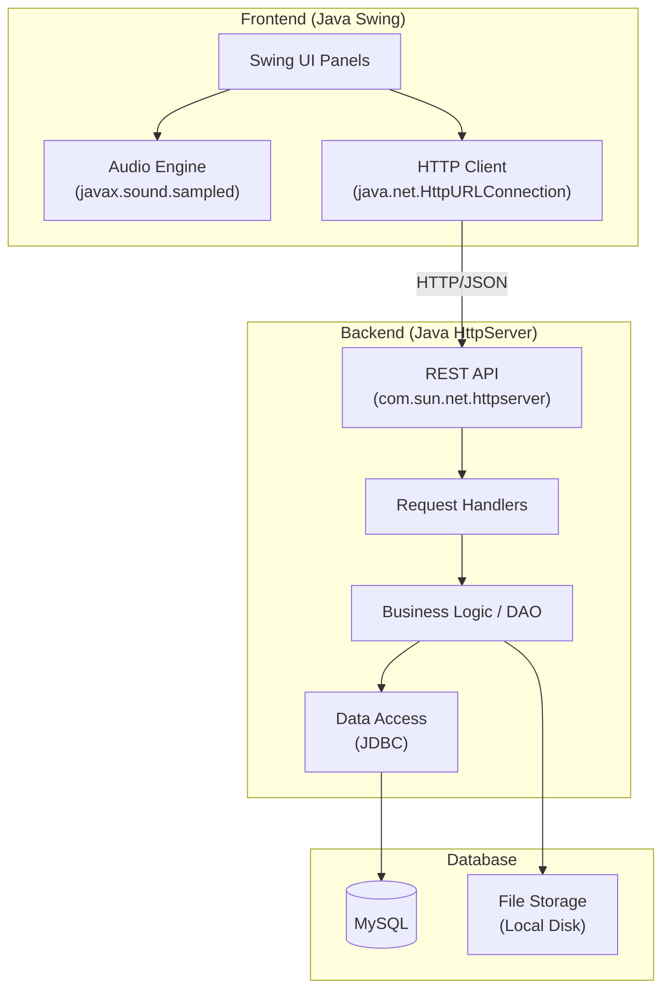

# TAH Music App - Pure Java

Xây dựng ứng dụng phát nhạc tương tự SoundCloud, hoàn toàn bằng Java thuần (không thư viện ngoài), chia thành Backend và Frontend riêng biệt.

## Kiến trúc tổng quan



## Công nghệ sử dụng (tất cả đều có sẵn trong JDK)

| Thành phần | Công nghệ |
|---|---|
| REST API Server | `com.sun.net.httpserver.HttpServer` |
| Database | MySQL + `java.sql` (JDBC) |
| JSON | Custom helper (`JsonHelper`) |
| HTTP Client | `java.net.HttpURLConnection` |
| GUI | `javax.swing` + `java.awt` |
| Audio Playback | `javax.sound.sampled` (hỗ trợ WAV) |
| Authentication | Session token |
| Build | Maven (Dependency duy nhất: `mysql-connector-java`) |

> [!IMPORTANT]
> **Định dạng âm thanh:** `javax.sound.sampled` chỉ hỗ trợ native WAV, AIFF, AU. Ứng dụng này tập trung hỗ trợ định dạng **WAV**.

---

## Tính năng chính

### Phase 1 - Core (MVP)
| # | Tính năng | Mô tả |
|---|---|---|
| 1 | Đăng ký / Đăng nhập | Tạo tài khoản, đăng nhập bằng username/password |
| 2 | Upload nhạc | Upload file WAV kèm metadata |
| 3 | Phát nhạc | Play/Pause/Stop, thanh tiến trình, điều chỉnh âm lượng |
| 4 | Duyệt nhạc | Trang chủ hiển thị danh sách bài hát |
| 5 | Tìm kiếm | Tìm bài hát |
| 6 | Hồ sơ người dùng | Xem profile cá nhân |
| 7 | Like bài hát | Thích/bỏ thích bài hát |
| 8 | Playlist | Tạo, quản lý playlist cá nhân |

### Phase 2 - Social & Enhancement
| # | Tính năng | Mô tả |
|---|---|---|
| 9 | Bình luận | Comment trên bài hát |
| 10 | Waveform | Hiển thị dạng sóng âm thanh (WaveformPanel) |

---

## Cấu trúc dự án

```text
d:\KI_6\app_phat_nhac\
├── README.md
├── backend\
│   ├── pom.xml
│   └── src\main\java\com\btl\backend\
│       ├── server\
│       │   └── MusicServer.java          (Main - khởi động HttpServer)
│       ├── handler\
│       │   ├── AuthHandler.java          (POST /api/auth/register, /api/auth/login)
│       │   ├── TrackHandler.java         (CRUD /api/tracks)
│       │   ├── PlaylistHandler.java      (CRUD /api/playlists)
│       │   ├── UserHandler.java          (GET /api/users/{id})
│       │   ├── CommentHandler.java       (CRUD /api/tracks/{id}/comments)
│       │   ├── LikeHandler.java          (POST/DELETE /api/tracks/{id}/like)
│       │   ├── SearchHandler.java        (GET /api/search)
│       │   └── StreamHandler.java        (GET /api/tracks/{id}/stream)
│       ├── model\
│       │   ├── Users.java
│       │   ├── Tracks.java
│       │   ├── PlayLists.java
│       │   └── Comments.java
│       ├── DAO\
│       │   ├── UsersDAO.java
│       │   ├── TracksDAO.java
│       │   ├── PlaylistsDAO.java
│       │   ├── CommentsDAO.java
│       │   └── LikeDAO.java
│       └── util\
│           ├── JsonHelper.java           (Custom JSON parser/builder)
│           ├── DBConnection.java         (JDBC connection pool)
│           ├── SessionManager.java       (Token management)
│           ├── HttpHelper.java           (Request/Response utilities)
│           └── FileStorageManager.java   (Lưu/đọc file nhạc trên disk)
│
├── frontend\
│   ├── pom.xml
│   └── src\main\java\com\btl\frontend\
│       ├── app\
│       │   └── MusicApp.java             (Main - khởi động Swing)
│       ├── ui\
│       │   ├── MainFrame.java            (JFrame chính, navigation)
│       │   ├── LoginPanel.java           (Đăng nhập / Đăng ký)
│       │   ├── HomePanel.java            (Trang chủ)
│       │   ├── TrackPanel.java           (Chi tiết bài hát + comments)
│       │   ├── UploadPanel.java          (Upload nhạc)
│       │   ├── ProfilePanel.java         (Hồ sơ người dùng)
│       │   ├── PlaylistPanel.java        (Quản lý playlist)
│       │   ├── SearchPanel.java          (Tìm kiếm)
│       │   ├── PlayerBar.java            (Thanh player cố định dưới cùng)
│       │   └── WaveformPanel.java        (Vẽ waveform)
│       ├── audio\
│       │   └── AudioPlayer.java          (javax.sound.sampled engine)
│       ├── api\
│       │   └── ApiClient.java            (HttpURLConnection wrapper)
│       └── util\
│           ├── IconFactory.java          (Tạo icon tùy chỉnh)
│           ├── JsonHelper.java           (JSON parser cho frontend)
│           └── UIConstants.java          (Colors, fonts, dimensions)
```

---

## Database Schema (Tham khảo)

```sql
-- Users
CREATE TABLE users (
    id INT AUTO_INCREMENT PRIMARY KEY,
    username VARCHAR(50) UNIQUE NOT NULL,
    password_hash VARCHAR(255) NOT NULL,
    display_name VARCHAR(100) NOT NULL,
    avatar_path VARCHAR(500),
    created_at TIMESTAMP DEFAULT CURRENT_TIMESTAMP
);

-- Tracks  
CREATE TABLE tracks (
    id INT AUTO_INCREMENT PRIMARY KEY,
    user_id INT NOT NULL,
    title VARCHAR(200) NOT NULL,
    artist VARCHAR(200),
    file_path VARCHAR(500) NOT NULL,
    play_count INT DEFAULT 0,
    created_at TIMESTAMP DEFAULT CURRENT_TIMESTAMP,
    FOREIGN KEY (user_id) REFERENCES users(id) ON DELETE CASCADE
);

-- Playlists
CREATE TABLE playlists (
    id INT AUTO_INCREMENT PRIMARY KEY,
    user_id INT NOT NULL,
    name VARCHAR(200) NOT NULL,
    created_at TIMESTAMP DEFAULT CURRENT_TIMESTAMP,
    FOREIGN KEY (user_id) REFERENCES users(id) ON DELETE CASCADE
);

-- Likes
CREATE TABLE likes (
    user_id INT NOT NULL,
    track_id INT NOT NULL,
    created_at TIMESTAMP DEFAULT CURRENT_TIMESTAMP,
    PRIMARY KEY (user_id, track_id),
    FOREIGN KEY (user_id) REFERENCES users(id) ON DELETE CASCADE,
    FOREIGN KEY (track_id) REFERENCES tracks(id) ON DELETE CASCADE
);

-- Comments
CREATE TABLE comments (
    id INT AUTO_INCREMENT PRIMARY KEY,
    user_id INT NOT NULL,
    track_id INT NOT NULL,
    content TEXT NOT NULL,
    created_at TIMESTAMP DEFAULT CURRENT_TIMESTAMP,
    FOREIGN KEY (user_id) REFERENCES users(id) ON DELETE CASCADE,
    FOREIGN KEY (track_id) REFERENCES tracks(id) ON DELETE CASCADE
);
```

---

## API Endpoints

### Authentication
| Method | Path | Mô tả |
|---|---|---|
| POST | `/api/auth/register` | Đăng ký tài khoản mới |
| POST | `/api/auth/login` | Đăng nhập, trả về session token |

### Tracks
| Method | Path | Mô tả |
|---|---|---|
| GET | `/api/tracks` | Danh sách bài hát |
| POST | `/api/tracks` | Upload bài hát mới |
| GET | `/api/tracks/{id}/stream` | Stream audio file |

### Comments & Likes
| Method | Path | Mô tả |
|---|---|---|
| POST | `/api/tracks/{id}/like` | Like bài hát |
| GET | `/api/tracks/{id}/comments` | Danh sách comment |
| POST | `/api/tracks/{id}/comments` | Thêm comment |

### Playlists
| Method | Path | Mô tả |
|---|---|---|
| GET | `/api/playlists` | Danh sách playlist của user |
| POST | `/api/playlists` | Tạo playlist mới |

---

## Thiết kế UI

### Color Palette (Dark Theme)
```
Background:       #121212 (gần đen)
Surface:          #1E1E1E (panel background)
Primary:          #1DB954 (Xanh lá - style Spotify) hoặc #FF5500 (Cam - style SoundCloud)
Text Primary:     #FFFFFF
Text Secondary:   #B3B3B3
Waveform:         Primary Color (played) / #555555 (unplayed)
```

### Layout
```
┌──────────────────────────────────────────────────┐
│  🎵 App Nhạc     [Search Bar]      [Profile] [⬆] │  ← Top Bar (MainFrame)
├──────────┬───────────────────────────────────────┤
│          │                                       │
│  Home    │     Main Content Area                 │
│  Search  │     (CardLayout switches panels)      │
│  Playlist│                                       │
│  Upload  │     ┌─────────────────────────────┐   │
│  Profile │     │  Track cards / Panels       │   │
│          │     └─────────────────────────────┘   │
├──────────┴───────────────────────────────────────┤
│ ▶ ■ ⏮ ⏭  ───●──────── 2:45/5:30  🔊 ████░░  │  ← Player Bar
└──────────────────────────────────────────────────┘
```

---

## Verification Plan

### Automated Tests
- Chạy backend server (`MusicServer.main`), test từng API endpoint bằng postman/curl.
- Build Maven đảm bảo không có lỗi biên dịch.

### Manual Verification
- Khởi động Backend -> Frontend (`MusicApp.main`).
- Test flow: Đăng ký/Đăng nhập -> Upload file WAV -> Trang chủ (Nghe thử nhạc) -> Tìm kiếm -> Thêm vào Playlist.
- Kiểm tra tính ổn định của `AudioPlayer` và hiệu ứng sóng nhạc `WaveformPanel`.
